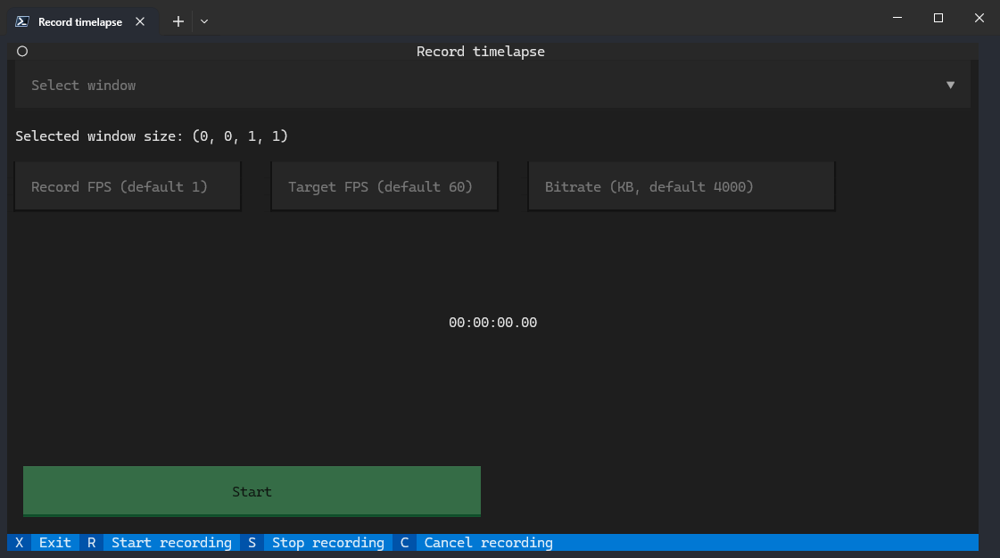
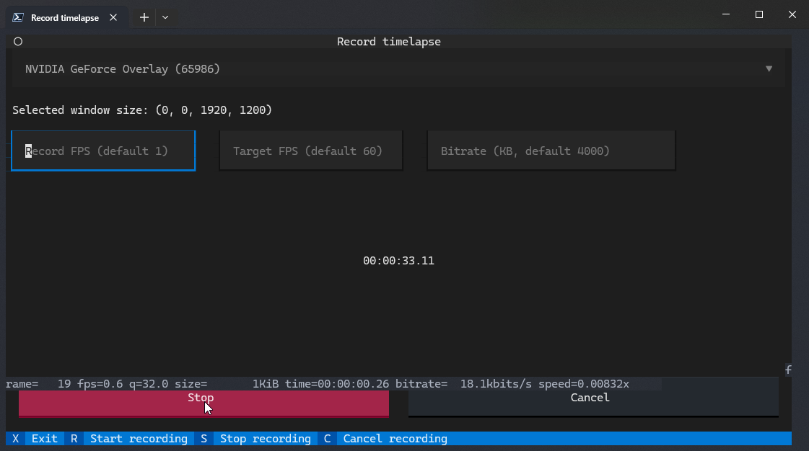

# Record timelapse

This is accompany application to record timelapse videos. Recording done with `ffmpeg` and UI add controls to select desired window (hence, select screen region) and record it. Note, that recording does not support recording window exculsively, so other windows on top of it would be visible on recording. Also script doesn't track window movement, so if you need to move starting recording region, you need to Stop recording, reselect window and start recording again.

Code for app is heavily relying on Windows features, so it's not supported in Linux and Mac. While it is possible to support them, a lot would need to be changed.

# Installation

1. [**Windows Terminal**](https://apps.microsoft.com/detail/9n0dx20hk701) is a must use terminal for application, it solve a lot of issues other Windows terminals have and allow you to open it in any folder from explorer RMB menu, which you will need later. It also allow you to **minimize it in tray**, which would be needed during recording. It is installed in Microsoft Store.
2. [**Python**](https://www.python.org/downloads/windows/) is it what this script is running on. During installation make sure to check options for "Adding to PATH" and "Install for all users". First would allow you to run python without specifing path to executable (just `python` instead of `C:\Program Files\Python\Python312\python.exe`), 2nd would install it for everyone, instead if install it in `AppData` which could also create some issues later.
3. [**ffmpeg**](https://ffmpeg.org/download.html#build-windows) (choose within "release builds" "ffmpeg-release-full.7z" version) - it is program that would record screen. It does not require installation, instead you should unpack it into some accessible directory, for example `C:\ffmpeg` and then add to PATH variable it's subfolder `bin` where is `ffmpeg.exe` file. Same as with Python it will allow to run it with just `ffmpeg`. Alternatively you could extract just `ffmpeg.exe` in folder of this script.
4. Optionally install libraries, that used in app with `pip install pywin32 textual` - they would installed automatically on the first run if you doesn't do so. (`pip` is installed with Python and if not added to PATH during installation, you will get error, that "pip is not found")

# Run

Open Windows Terminal _(or other terminal)_ within same folder, where is `record_timelapse.py` _(you can right click in explorer and choose "Open in Terminal")_ and run command:

```sh
python ./record_timelapse.py
```

If python installed correctly, it could also handle running python files by itself, so you could try to use shorter command:

```sh
./record_timelapse.py
```

You will see an UI with some fields.



You will need then select desired window to record and you already could hit **Start** button, but optionally you also have 3 fields:

1. Record FPS - at this FPS video is recorded. Default _(when unspecified)_ is is 1 frame per second. You can put float value here, for example 1.5, or 0.1 (mean 1 frame every 10 seconds)
2. Target FPS - this is output FPS that resulting video will have. Default _(when unspecified)_ is 60 FPS. In case of default scenario video is speedup 60 times.
3. Bitrate (in KB/s) - bitrate at which video will be encoded. Default _(when unspecified)_ is 4000 KB/s, which is suitable for 1080p. A few recommendation here: if you record static videos, where is not much changed on screen, it could be lowered. In contrast for dynamic video it need to be increased to not get blocky artifacts. If record FPS is increased, it also could be slightly lowered, as changes between frames would be negligible, but if record FPS is lowered, you may need increase bitrate as well.

**Stop** button - stop recording and save video, while
**Cancel** button - cancel recording and wont save video.

Default save folder is subfolder to script `/recordings/` and recordings file name contain date and time of recording, e.g. `timelapse_2024.04.13_17.53.19.mkv`.

There is also **hotkeys** when console is in focus:

-   `X` - exit program _(and stop amd save recording)_
-   `R` - start recording _(start only if window selected)_
-   `S` - stop recording _(save file)_
-   `C` - cancel recording _(wont save file)_

It is also possible to click on them in UI.

When recrding started, you will see buttons would be changed as well somewhere on the screen ffmpeg output (this is not desireable output and position of output is always changed, but I still desided to leave it as is, so that you see more internal process of recording. Unless I find a better solution to log it on screen it would be like that)



You will also see timer. Timer is not video output timer, but rather realtime timer. `ffmpeg` timer however is output video timer. For example with default configuration at 6 minute recodring mark, you will see 6 seconds in ffmpeg output.

# Recording codecs

Recording is done in **H.264** codec. At this moment script utilize GPU, so **NVENC** is used as well, which mean you would need Nvidia GPU.

You could change that to CPU by switching codec to **x264**.

An exact command in a script would be _(this is command from code)_:

```py
self.cmd = [
	"ffmpeg",
	"-v", "quiet",
	"-stats",
	"-f", "gdigrab",
	"-thread_queue_size", "1024",
	"-rtbufsize", "256M",
	"-framerate", f"{self.record_fps}",
	"-offset_x", f"{max(self.box[0], 0)}",
	"-offset_y", f"{max(self.box[1], 0)}",
	"-video_size", f"{min(self.box[2], WINDOW_MAX_WIDTH)}x{min(self.box[3], WINDOW_MAX_HEIGHT)}",
	"-show_region", "0",
	"-i", "desktop",
	"-filter_complex", f"settb={settb},setpts=N/TB/{setpts}",
	"-c:v", "h264_nvenc", # <-- here is codec
	"-r", f"{self.target_fps}",
	"-preset", "p4", # <-- here is preset
	"-tune", "hq", # <-- here is tune
	"-b:v", f"{self.bitrate}k",
	"-movflags", "+faststart",
	"-y",
	f"recordings/timelapse_{datetime.now().strftime('%Y.%m.%d_%H.%M.%S')}.mkv",
]
```

`h264_nvenc` replaced to `libx264` and preset replaced from `p4` to `ultrafast`, `-tune hq` option need to be replaced to `"-threads",` `"0",`

Also container could be changed from Matroska (`.mkv`) to `.mp4`
